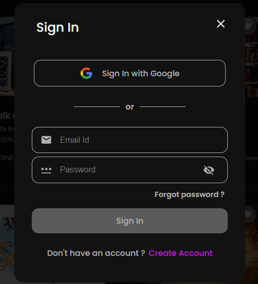
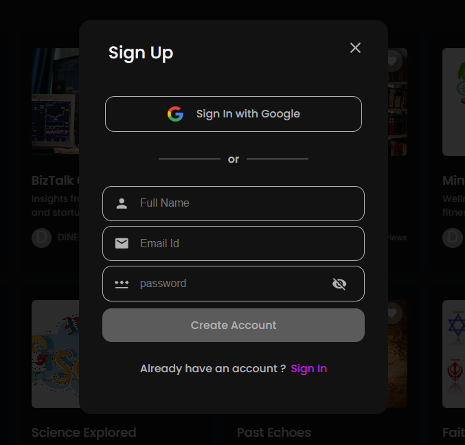
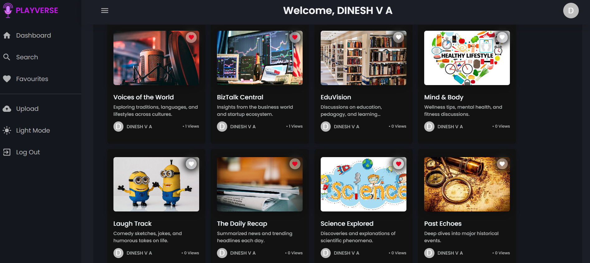
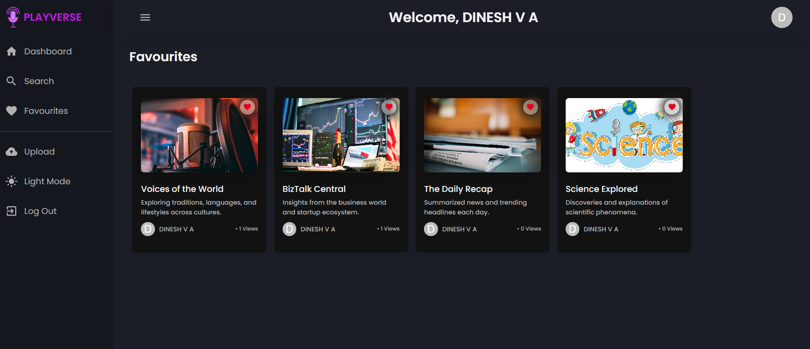
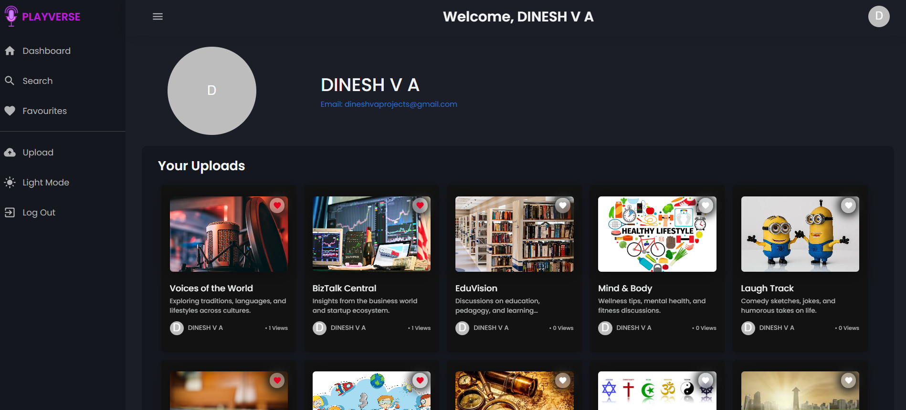
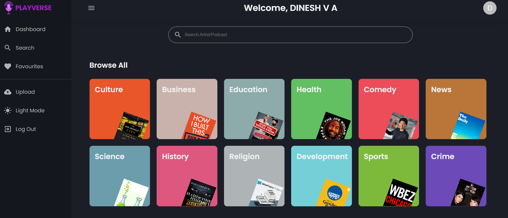
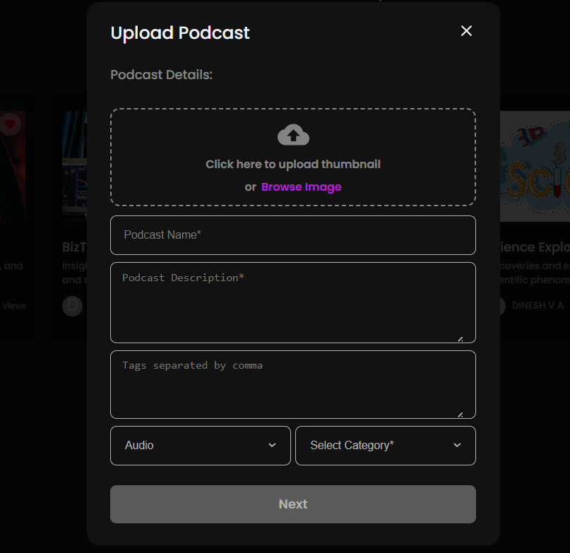
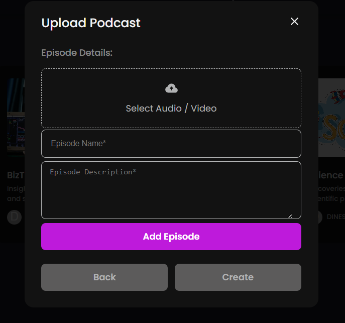

# 🎧 Playverse – Podcast Streaming Platform

**Playverse** is a powerful full-stack web application that delivers a seamless and engaging podcast experience. Built with modern web technologies, it allows users to search, stream, and manage their favorite podcasts while also enabling creators and admins to upload and manage content through a dedicated admin panel.

---

## 🚀 Key Features

- 🔐 **User Authentication**
  - Secure login/signup using **Google OAuth** and **JWT-based authentication**.
  - Backend authentication handled using **Firebase** and **Node.js**.

- 🔍 **Podcast Search**
  - Quickly search and filter through a wide range of podcasts using intuitive search functionality.

- 🏆 **Popular Podcasts Display**
  - Home dashboard features trending and most-played podcasts.

- 🎙️ **Admin Panel**
  - Admin dashboard for adding, editing, and managing podcast content.

- ❤️ **Favorite Podcasts**
  - Users can add podcasts to their favorites list and revisit them anytime.

- ⏸️ **Pause & Resume**
  - Users can pause a podcast and continue listening later from the same timestamp.

- 📱 **Responsive Design**
  - Built with **React.js**, offering seamless performance across mobile, tablet, and desktop devices.

- 🔁 **Agile Development**
  - Developed using Agile methodologies to ensure iterative improvements, regular updates, and high team productivity.

---
## 🌐 Live Demo

👉 [View Web App]()

🎥 [Screencast Demo Video](https://drive.google.com/file/d/1gMMEOnxnyx3RFZ0WDUdxyQYTvKX_1NO_/view?usp=drive_link)

---
## 🖼️ Screenshots

Here are some UI previews of the Playverse web application:

### 🔹 Sign In


### 🔹 Sign Up


### 🔹 Dashboard


### 🔹 Favourites


### 🔹 Profile


### 🔹 Search


### 🔹 Upload (Admin Panel View 1)


### 🔹 Upload (Admin Panel View 2)


---
## 🛠️ Tech Stack

The application is built using the **MERN Stack** along with third-party integrations for authentication and hosting:

### 💻 Frontend
- **React.js** – For building interactive and dynamic user interfaces
- **HTML5 & CSS3** – For structuring and styling content
- **JavaScript (ES6+)** – For client-side logic and functionality

### 🧠 Backend
- **Node.js** – Runtime environment for server-side logic
- **Express.js** – Web framework for building RESTful APIs

### 🗃️ Database
- **MongoDB** – NoSQL database for storing user and podcast data
- **Mongoose** – ODM for MongoDB to manage data relationships

### 🔐 Authentication
- **Google OAuth** – For secure and convenient user login
- **Firebase** – For user authentication and real-time services
- **JWT (JSON Web Token)** – For handling secure user sessions

### 🌐 Hosting / Deployment
- **Netlify** – For deploying the frontend (React)
- **Render / Railway** – For deploying the backend (Node.js & MongoDB)

---

> This tech stack ensures fast performance, scalability, and a smooth developer experience.

# 🚀 Getting Started

Follow the step-by-step instructions below to set up the Playverse project locally on your machine for development and testing purposes.

---


## 🔧 Prerequisites

Before setting up the project, ensure you have the following software installed on your system:

### Required Software

- **[Node.js](https://nodejs.org/)** (v14.0.0 or later) - JavaScript runtime
- **[npm](https://www.npmjs.com/)** (v6.0.0 or later) - Package manager (comes with Node.js)
- **[MongoDB](https://www.mongodb.com/)** - Database (local installation or MongoDB Atlas)
- **[Git](https://git-scm.com/)** - Version control system

### Optional but Recommended

- **[Yarn](https://yarnpkg.com/)** - Alternative package manager
- **[MongoDB Compass](https://www.mongodb.com/products/compass)** - MongoDB GUI
- **[Postman](https://www.postman.com/)** - API testing tool
- **[VS Code](https://code.visualstudio.com/)** - Code editor with extensions

### System Requirements

- **Operating System**: Windows 10+, macOS 10.14+, or Linux
- **RAM**: 4GB minimum (8GB recommended)
- **Storage**: 1GB free space
- **Internet Connection**: Required for initial setup and Firebase authentication

### Verify Installation

Check if the required software is properly installed:

```bash
# Check Node.js version
node --version

# Check npm version
npm --version

# Check Git version
git --version

# Check MongoDB version (if installed locally)
mongod --version
```

---

## ⬇️ Clone the Repository

### 1. Clone from GitHub

```bash
# Clone the repository
git clone https://github.com/v-a-dinesh/Playverse.git

# Navigate to project directory
cd Playverse

# Verify the clone was successful
ls -la
```

### 2. Alternative: Download ZIP

If you prefer not to use Git:

1. Go to [https://github.com/v-a-dinesh/Playverse](https://github.com/v-a-dinesh/Playverse)
2. Click the "Code" button
3. Select "Download ZIP"
4. Extract the downloaded file
5. Navigate to the extracted folder

---

## 🖥️ Starting the Application

### 1️⃣ Start the React App (Client)

#### Install Frontend Dependencies

```bash
# Navigate to client directory
cd client

# Install all required packages
npm install

# Alternative: Use Yarn
yarn install
```

#### Start the Development Server

```bash
# Start React development server
npm start

# Alternative: Use Yarn
yarn start

# For production build
npm run build
```

**Expected Output:**
```
Compiled successfully!

You can now view playverse in the browser.

  Local:            http://localhost:3000
  On Your Network:  http://192.168.1.xxx:3000

Note that the development build is not optimized.
To create a production build, use npm run build.
```

The React app will run at **http://localhost:3000**

---

### 2️⃣ Start the Backend Server (Server)

Open a **new terminal window** and run:

#### Install Backend Dependencies

```bash
# Navigate to server directory (from project root)
cd server

# Install all required packages
npm install

# Alternative: Use Yarn
yarn install
```

#### Start the Server

```bash
# Start Express backend server
npm start

# For development with auto-restart
npm run dev

# Alternative: Use Yarn
yarn start
```

**Expected Output:**
```
Server running on port 5000
MongoDB connected successfully
Firebase initialized
🚀 Playverse API server is ready!
```

The server will run at **http://localhost:5000**

---


## 🧪 Test the Application

### Step-by-Step Testing Process

Once both servers are running successfully:

#### 1. **Access the Application**
- Open your web browser
- Navigate to [http://localhost:3000](http://localhost:3000)
- You should see the Playverse homepage

#### 2. **Test Authentication**
- Click the **"Sign In with Google"** button
- Complete the Google OAuth flow
- Verify you're redirected back to the application
- Check that your profile information is displayed

#### 3. **Test Core Features**

**Browse Podcasts:**
- Explore the podcast library on the homepage
- Use the search functionality to find specific podcasts
- Apply filters by category, duration, or popularity

**Audio Streaming:**
- Click on any podcast to start streaming
- Test playback controls (play, pause, skip, volume)
- Verify audio quality and streaming stability

**User Features:**
- Add podcasts to your favorites
- View your listening history
- Create and manage playlists

#### 4. **Test Admin Features** (if applicable)
- Navigate to [http://localhost:3000/admin](http://localhost:3000/admin)
- Login with admin credentials
- Test adding new podcasts
- Verify content management functionality
- Check user management features

### 🔍 Troubleshooting Common Issues

#### Frontend Issues
```bash
# Clear React cache
npm start -- --reset-cache

# Delete node_modules and reinstall
rm -rf node_modules package-lock.json
npm install
```

#### Backend Issues
```bash
# Check if MongoDB is running
mongod --version

# Verify environment variables
echo $MONGO_URI

# Check server logs
npm run dev
```

#### Network Issues
```bash
# Check if ports are available
lsof -i :3000  # React app
lsof -i :5000  # Backend server

# Kill processes if needed
kill -9 $(lsof -t -i:3000)
```

### ✅ Success Indicators

Your setup is successful when you can:

- ✅ Access the React app at `http://localhost:3000`
- ✅ Backend API responds at `http://localhost:5000`
- ✅ Google authentication works properly
- ✅ Podcasts load and display correctly
- ✅ Audio streaming functions without errors
- ✅ Database operations (favorites, history) work
- ✅ Admin panel is accessible (if you have admin rights)

### 📞 Getting Help

If you encounter issues:

1. **Check the console** for error messages
2. **Verify environment variables** are set correctly
3. **Ensure all services are running** (React, Node.js, MongoDB)
4. **Check network connectivity** and port availability
5. **Review the logs** in both frontend and backend
6. **Consult the documentation** or create an issue on GitHub

---

**🎉 Congratulations! You now have Playverse running locally on your machine.**

## Conclusion

In conclusion, this podcast streaming application provides users with an easy-to-use platform for listening to their favorite podcasts. With features such as user authentication, podcast search, and an admin panel for creating and adding new podcasts, this application offers a comprehensive solution for podcast streaming. 

